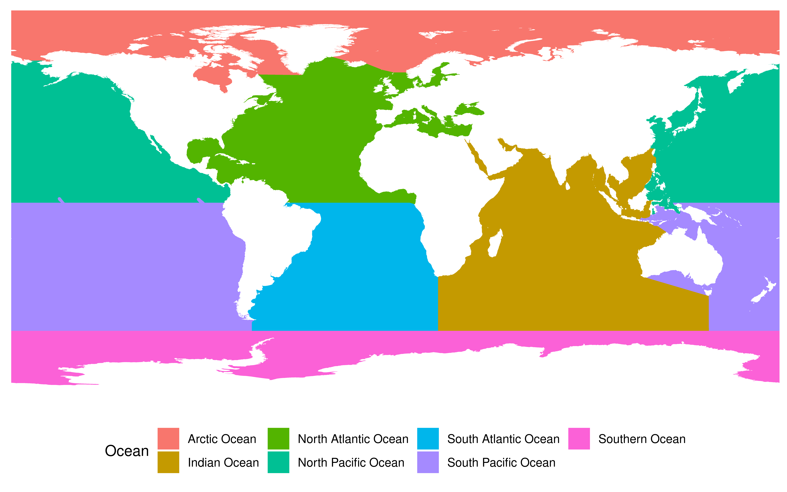

IslBirds: Identifying global island bird species & island geographic
distances
================

### BirdLife data

BirdLife data was obtained from the Birdlife DataZone under:
<http://datazone.birdlife.org/species/requestdis>

### eBird data

eBird raw data was obtained from:
<https://ebird.org/science/use-ebird-data>

### Island data

Island polygon data was obtained from Weigelt et al. 2013 and can be
accessed through the ggmap2 package: <https://github.com/RS-eco/ggmap2>

Small (&lt;= 5 km2) and large islands (&gt; 5 km2) data can be accessed
using the following code:

``` r
# Load island data remotes::install_github('RS-eco/ggmap2', build_vignettes =
# TRUE)
library(ggmap2)
library(dplyr)
library(sf)
data(largeislands, package = "ggmap2")
data(smallislands, package = "ggmap2")
islands <- bind_rows(largeislands, smallislands)
rm(largeislands, smallislands)
gc()
colnames(islands)

# Select certain islands by ulm_ID
islands %>% filter(ulm_ID %in% c(5224, 53611, 9827, 374)) %>% select(-geometry)

# Select island by English Name
islands %>% filter(NAME_ENGLI == "Cyprus") %>% select(-geometry)
```

### Island bird species numbers (BirdLife)

The code for extracting the BirdLife species that occur on the world’s
islands can be found under: “data-raw/02\_birdlife\_list\_islands.R”

The BirdLife species lists can be load into R, using:

``` r
load("data/island_birds.rda")
```

and data for individual islands can be accessed by:

``` r
# Check number of island species
length(unique(island_birds$SCINAME))

# Extract info for certain islands by ulm_id
island_birds %>% filter(ulm_id %in% c(81061, 52224, 5224, 53611, 9827, 374)) %>% 
    summarise(n_distinct(SCINAME))
# Christmas Island, Cyprus, French Southern Territories, La Reunion, Hawaii, Isla
# Hermite - Chile

# Extract number of bird species for Christmas island that cover more than 25 %
# of the island
island_birds %>% filter(ulm_id == 81061) %>% filter(perc_cover >= 25) %>% summarise(n_distinct(SCINAME))

# Extract number of bird species for Cyprus for different percentage coverage
# values
island_birds %>% filter(ulm_id == "52224") %>% summarise(n_distinct(SCINAME))
island_birds %>% filter(ulm_id == "52224") %>% filter(perc_cover >= 25) %>% summarise(n_distinct(SCINAME))
island_birds %>% filter(ulm_id == "52224") %>% filter(perc_cover >= 50) %>% summarise(n_distinct(SCINAME))
```

### Island bird species numbers (eBird)

The code for extracting the eBird species that occur on the world’s
large islands (&gt; 1 ha) can be found under:
“data-raw/05\_ebird\_list\_largeislands.R”

And the eBird species lists can be load into R, using:

``` r
load("data/ebd_largeislands.rda")
```

### Island geographic distances

Island geographic distances were calculated using the R-code, located
under: “data-raw/06\_island\_isolation.R”

``` r
load("data/dist_islands_df.rda")
load("data/islands_df.rda")
islands_df %>% filter(Island %in% c("Antipodes Island", "New Caledonia", "East Siberian Sea Islands", 
    "Sardinia", "Ostrov Sakhalin", "Bathurst Island", "Sri Lanka"))

# Check Anitpodes islands
dist_islands_df %>% filter(ulm_ID == 4946)
```

### Marine regions and IHO world seas

Marine regions were extracted from marine realms obtained from
marineregions.org. The R-code for processing the data can be found
under: “data-raw/07\_marineregions.R” and can be loaded into R, using:

``` r
load("data/marineregions.rda")

library(ggplot2)
ggplot() + geom_sf(data = marineregions, aes(fill = as.factor(Realm2)), colour = NA) + 
    scale_fill_manual(values = (ggsci::pal_d3("category20"))(8), name = "Realm", 
        guide = guide_legend(nrow = 4)) + labs(x = "", y = "") + theme_minimal() + 
    coord_sf(xlim = c(-180, 180), ylim = c(-86, 90), expand = FALSE, ndiscr = FALSE) + 
    theme(legend.position = "bottom", axis.title.y = element_text(angle = 0, hjust = 0))
```

<!-- -->

Major oceans were extracted from IHO World Seas also obtained from
marineregions.org. The R-code for processing the data can be found
under: “data-raw/08\_iho\_worldseas.R” and can be loaded into R, using:

``` r
load("data/world_seas.rda")

ggplot() + geom_sf(data = world_seas, aes(fill = Ocean), colour = NA) + labs(x = "", 
    y = "") + theme_minimal() + coord_sf(xlim = c(-180, 180), ylim = c(-86, 90), 
    expand = FALSE, ndiscr = FALSE) + theme(legend.position = "bottom", axis.title.y = element_text(angle = 0, 
    hjust = 0)) + coord_sf(ndiscr = 0)
```

<!-- -->

### Reading bird species MS Access database into R

The code for accessing bird species records stored in a MS Access
database, can be found under: “data-raw/09\_read\_accdb.R”. **Note:**
This code only works under Windows and requires the MS Access is
installed.
